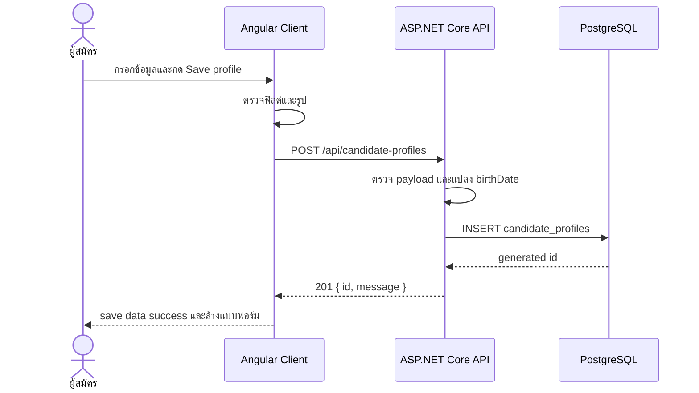

# RV-CP-01 — Runtime การบันทึกโปรไฟล์

```mermaid
sequenceDiagram
  actor Applicant as ผู้สมัคร
  participant Client as Angular Client
  participant Api as ASP.NET Core API
  participant Db as PostgreSQL
  Applicant->>Client: กรอกข้อมูลและกด Save profile
  Client->>Client: ตรวจฟิลด์และรูป
  Client->>Api: POST /api/candidate-profiles
  Api->>Api: ตรวจ payload และแปลง birthDate
  Api->>Db: INSERT candidate_profiles
  Db-->>Api: generated id
  Api-->>Client: 201 { id, message }
  Client-->>Applicant: save data success และล้างแบบฟอร์ม
```

หากการตรวจข้อมูลล้มเหลว ระบบตอบ `400`; หากการเชื่อมต่อหรือฐานข้อมูลล้มเหลว Client แสดงข้อผิดพลาดและไม่ล้างข้อมูล
