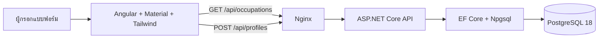

# AD-PF-01 — สถาปัตยกรรมโมดูล Profile

## องค์ประกอบ

| องค์ประกอบ    | เทคโนโลยี                                                                         | ความรับผิดชอบ                                                                   |
| ------------- | --------------------------------------------------------------------------------- | ------------------------------------------------------------------------------- |
| Client        | Angular 22, Angular Material, Material date-fns adapter, date-fns, Tailwind CSS 4 | รับข้อมูล ใช้ Material Datepicker ตรวจเบื้องต้น แปลงรูปเป็น Base64 และแสดงสถานะ |
| API           | ASP.NET Core 10 Web API, C#                                                       | ส่งข้อมูลหลักอาชีพ ตรวจ payload จับคู่ `occupationCode` และสร้าง Profile        |
| Persistence   | Entity Framework Core, Npgsql                                                     | จับคู่โมเดลและจัดการ migration                                                  |
| Database      | PostgreSQL 18                                                                     | เก็บระเบียนโปรไฟล์ ข้อมูลหลักอาชีพ และ foreign key ระหว่างกัน                   |
| Local runtime | OrbStack, Docker Compose, Nginx                                                   | เปิดสามบริการและส่ง `/api` จากหน้าเว็บไป API                                    |

## เส้นทางคำขอ

## ขอบเขต

- ไม่มีระบบพิสูจน์ตัวตนตามโจทย์ต้นทาง
- ไม่มีการเรียกระบบภายนอก
- Nginx ทำให้หน้าเว็บและ API มีต้นทางเดียวกันในการ deploy ผ่าน OrbStack
