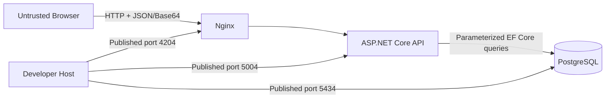

# SV-CP-02 — OWASP Security Baseline

## คำตัดสิน

ระบบปัจจุบัน **ผ่านขอบเขตข้อสอบแบบไม่ระบุตัวตน แต่ยังไม่พร้อม production ตาม OWASP** การยืนยันตัวตนและการกำหนดสิทธิ์ไม่อยู่ในข้อกำหนดต้นทาง จึงเป็น `OUT OF SCOPE` สำหรับผลข้อสอบ ไม่ใช่ข้อทดสอบที่ล้มเหลว ส่วนข้อควบคุม OWASP อื่นยังใช้ตามความเสี่ยงของระบบตามปกติ

เอกสารนี้ใช้ OWASP ASVS 5.0.0 เป็นกรอบตรวจยืนยัน ใช้ OWASP Top 10:2025 และ OWASP API Security Top 10:2023 สำหรับความเสี่ยง และใช้ OWASP File Upload Cheat Sheet สำหรับรูปโปรไฟล์

## การจำแนกขอบเขตการควบคุม

| หัวข้อ                                  | ขอบเขตข้อสอบ | คำตัดสินสำหรับ production                                                                                                        |
| --------------------------------------- | ------------ | -------------------------------------------------------------------------------------------------------------------------------- |
| การยืนยันตัวตน (Authentication)         | OUT OF SCOPE | ต้องยืนยันรูปแบบการเข้าถึงก่อน: ถ้าเป็นฟอร์มสาธารณะให้ใช้มาตรการป้องกันการใช้งานผิดวัตถุประสงค์; ถ้าต้องผูกผู้ใช้ให้เพิ่มกลไกนี้ |
| การกำหนดสิทธิ์ (Authorization)          | OUT OF SCOPE | ยังไม่มี endpoint อ่าน แก้ไข หรือลบที่ต้องตรวจเจ้าของข้อมูล; ถ้าเพิ่มความสามารถดังกล่าวต้องกำหนดและบังคับสิทธิ์ที่ API           |
| การตรวจข้อมูลนำเข้าและป้องกัน Injection | IN SCOPE     | ต้องบังคับที่ API และคงการใช้คำสั่งฐานข้อมูลแบบใส่พารามิเตอร์                                                                    |
| ไฟล์ รูปภาพ และการใช้ทรัพยากร           | IN SCOPE     | ต้องจำกัดขนาด ตรวจชนิดไฟล์จริง จำกัดอัตราคำขอ และป้องกันการส่งคำขอจำนวนมาก                                                       |
| ข้อมูลส่วนบุคคล การตั้งค่า และบันทึก    | IN SCOPE     | ต้องป้องกันข้อมูลลับ ลดการเปิดพอร์ต ปิดรายละเอียดข้อผิดพลาด และไม่บันทึกข้อมูลส่วนบุคคลหรือ Base64                               |

## มาตรฐานอ้างอิง

| แหล่ง                                                                                                                                    | รุ่น/สถานะ    | การใช้ในระบบนี้                                                                                 |
| ---------------------------------------------------------------------------------------------------------------------------------------- | ------------- | ----------------------------------------------------------------------------------------------- |
| [OWASP ASVS](https://owasp.org/www-project-application-security-verification-standard/)                                                  | 5.0.0, stable | เกณฑ์ตรวจ access control, validation, data protection, communication, configuration และ logging |
| [OWASP Top 10](https://owasp.org/Top10/)                                                                                                 | 2025          | กรอบความเสี่ยงหลักของ web application และ secure design review                                  |
| [OWASP API Security Top 10](https://owasp.org/API-Security/editions/2023/en/0x11-t10/)                                                   | 2023          | ตรวจ public API, property exposure, resource consumption และ security misconfiguration          |
| [OWASP API4: Unrestricted Resource Consumption](https://owasp.org/API-Security/editions/2023/en/0xa4-unrestricted-resource-consumption/) | 2023          | กำหนด request size, decoded image size, timeout และ rate limit                                  |
| [OWASP File Upload Cheat Sheet](https://cheatsheetseries.owasp.org/cheatsheets/File_Upload_Cheat_Sheet.html)                             | current       | กำหนด allowlist, file signature, storage isolation, malware scan และ upload limit               |

## Protected Assets

| Asset                                    | ความอ่อนไหว                              | ผลกระทบเมื่อรั่วไหลหรือถูกแก้ไข                            |
| ---------------------------------------- | ---------------------------------------- | ---------------------------------------------------------- |
| ชื่อ นามสกุล อีเมล โทรศัพท์ วันเกิด เพศ  | ข้อมูลส่วนบุคคล                          | การละเมิดความเป็นส่วนตัวและการนำข้อมูลไปใช้ผิดวัตถุประสงค์ |
| รูปโปรไฟล์ Base64                        | ข้อมูลส่วนบุคคลและ input ที่ผู้ใช้ควบคุม | ข้อมูลรั่วไหล การใช้พื้นที่ฐานข้อมูล และไฟล์ปลอม           |
| Occupation master data                   | ข้อมูลอ้างอิงภายใน                       | หน้าเว็บแสดงตัวเลือกผิดหรือบันทึก foreign key ผิด          |
| PostgreSQL credential และข้อมูลเชื่อมต่อ | secret                                   | เข้าถึงหรือเปลี่ยนข้อมูลทั้งระบบ                           |

## Trust Boundary

Browser และ payload เป็น untrusted เสมอ การตรวจฝั่ง Angular เป็นเพียง usability control; API ต้องเป็นผู้บังคับกฎทั้งหมด

## OWASP Control Matrix

| Control area                 | สถานะ                 | หลักฐานปัจจุบัน                                                    | ช่องว่าง/สิ่งที่ต้องทำ                                                                             |
| ---------------------------- | --------------------- | ------------------------------------------------------------------ | -------------------------------------------------------------------------------------------------- |
| Server-side input validation | ทำแล้วและทดสอบผ่าน    | DataAnnotations, `IValidatableObject`, code lookup, request limit  | คง negative tests และทบทวนเพดานตามปริมาณใช้งานจริง                                                 |
| Injection prevention         | ทำแล้ว                | EF Core ใช้ query parameter และไม่มี SQL จากผู้ใช้                 | คง dependency scan และห้ามต่อ SQL จาก payload                                                      |
| Authentication               | OUT OF SCOPE          | ข้อสอบกำหนดเพียงฟอร์มสร้างข้อมูลแบบไม่ระบุตัวตน                    | production ต้องยืนยันว่าจะคงแบบสาธารณะพร้อม anti-abuse หรือเพิ่มกลไกยืนยันตัวตนตามความต้องการจริง  |
| Authorization                | OUT OF SCOPE          | ไม่มี endpoint อ่าน แก้ไข หรือลบ และไม่มีข้อกำหนด role/ownership   | เพิ่มและทดสอบเมื่อมีข้อมูลหรือการกระทำที่ต้องจำกัดสิทธิ์                                           |
| File upload validation       | ทำแล้วตามขอบเขตข้อสอบ | allowlist MIME, Base64 decode, decoded size 2 MiB, file signature  | production ยังต้องพิจารณา decode/re-encode, object storage และ malware scan                        |
| Resource consumption         | ทำแล้วตามขอบเขตข้อสอบ | Nginx/Kestrel 3 MiB, 20 POST/IP/minute, container CPU/memory limit | production ต้องปรับ limit, timeout และขนาดทรัพยากรจากข้อมูลใช้งานจริง                              |
| Data protection              | ยังไม่ครบ             | PostgreSQL volume และ `.env` ไม่เข้า git                           | เพิ่ม TLS, encryption at rest, retention/deletion, backup protection และ masking ใน non-production |
| Secret management            | local only            | `.env` ถูก ignore; มีค่าทดสอบใน compose                            | production ใช้ secret manager และหมุน credential; ห้ามค่าตั้งต้นที่เดาได้                          |
| Error handling               | ทำแล้ว; รอทดสอบ 500   | Problem Details พร้อม `traceId`; Client ไม่แสดง SQL                | เพิ่ม controlled failure test ใน non-Development profile                                           |
| Security logging             | ทำแล้วบางส่วน         | ไม่บันทึก request body; rate-limit log มี method, path, traceId    | เพิ่มเหตุการณ์ปฏิเสธอื่นโดยไม่เก็บ PII/Base64                                                      |
| Browser security             | ทำแล้วสำหรับ local    | CSP, MIME sniffing, frame, referrer และ permissions headers ผ่าน   | production ต้องใช้ HTTPS และทบทวน CSP ตามปลายทางจริง                                               |
| Network exposure             | ทำแล้วสำหรับ local    | ทุกพอร์ต compose ผูก `127.0.0.1`; Docker network แยก service       | production ห้าม publish PostgreSQL และห้ามเปิด API ตรงข้าม Nginx                                   |
| Dependency assurance         | ทำแล้วแบบ manual      | `npm audit` และ NuGet vulnerability scan ผ่าน                      | ย้ายเป็น CI/CD gate พร้อม lockfile และรอบอัปเดต dependency                                         |

## File Upload Decision

รุ่นทดสอบเก็บรูปเป็น Base64 ใน PostgreSQL เพราะโจทย์กำหนด แต่ production ต้องแยก binary ออกจาก business row เป็น object storage ส่วนตัว ใช้ชื่อที่ระบบสร้าง ตรวจ file signature จำกัดขนาดก่อนอ่านทั้งหมด สแกน malware เมื่อเหมาะสม และให้ฐานข้อมูลเก็บเพียง object key กับ metadata

การตรวจ file signature พิสูจน์ได้เพียงชนิดไฟล์พื้นฐาน **ไม่ได้พิสูจน์ว่าไฟล์ปลอด malware หรือถอดรหัสได้สมบูรณ์** จึงยังต้องใช้มาตรการเพิ่มเมื่อเป็น production

## Production Security Gate

ห้าม deploy ภายนอกเครื่องจนกว่าจะผ่านทุกข้อ:

1. ยืนยัน access model: ฟอร์มสาธารณะต้องมี anti-abuse, consent และ privacy control; หากต้องผูกตัวตนหรือเจ้าของข้อมูลให้เพิ่ม authentication และ authorization พร้อม security test
2. เปิด HTTPS เท่านั้น กำหนด security headers และ CORS เฉพาะ origin จริง
3. ยืนยันว่า production ไม่ publish PostgreSQL และไม่เปิด API ตรงข้าม Nginx
4. ทบทวน request-body limit, rate limit, timeout และ container resource limit ตามปริมาณใช้งานจริง
5. ย้ายรูปไป private object storage พร้อม retention/deletion policy และพิจารณา decode/re-encode กับ malware scan
6. ใช้ secret manager และแยก credential ต่อสภาพแวดล้อม
7. กำหนด encryption, backup, masking และ incident response สำหรับข้อมูลส่วนบุคคล
8. เพิ่ม security logging ที่ redact PII และ Base64 พร้อม correlation ID
9. ทำ SAST, dependency scan, secret scan และ DAST เป็น CI/CD gate
10. รันและผ่าน `QAT-CP-08` ก่อนอนุมัติ production

## Residual Risk for Local Test

- ผู้ใช้บนเครื่องเดียวกันยังเรียก API หรือ PostgreSQL ผ่านพอร์ต loopback ได้
- ฟอร์มสาธารณะยังไม่มี CAPTCHA หรือกลไกป้องกัน bot นอกเหนือจาก rate limit ต่อ IP
- file signature ลดไฟล์ปลอมพื้นฐาน แต่ยังไม่ใช่การสแกน malware หรือ decode/re-encode
- ข้อมูลส่วนบุคคลและรูปถูกเก็บในฐานข้อมูลโดยไม่มี retention workflow
