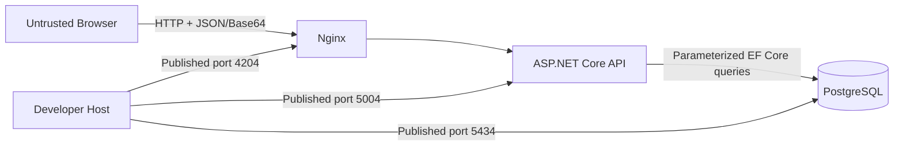

# SV-CP-02 — OWASP Security Baseline

## คำตัดสิน

ระบบปัจจุบัน **ยังไม่พร้อม production ตาม OWASP** เอกสารนี้ใช้ OWASP ASVS 5.0.0 เป็นกรอบตรวจยืนยัน ใช้ OWASP Top 10:2025 และ OWASP API Security Top 10:2023 สำหรับความเสี่ยง และใช้ OWASP File Upload Cheat Sheet สำหรับรูปโปรไฟล์

## มาตรฐานอ้างอิง

| แหล่ง                                                                                                                                    | รุ่น/สถานะ    | การใช้ในระบบนี้                                                                                 |
| ---------------------------------------------------------------------------------------------------------------------------------------- | ------------- | ----------------------------------------------------------------------------------------------- |
| [OWASP ASVS](https://owasp.org/www-project-application-security-verification-standard/)                                                  | 5.0.0, stable | เกณฑ์ตรวจ access control, validation, data protection, communication, configuration และ logging |
| [OWASP Top 10](https://owasp.org/Top10/)                                                                                                 | 2025          | กรอบความเสี่ยงหลักของ web application และ secure design review                                  |
| [OWASP API Security Top 10](https://owasp.org/API-Security/editions/2023/en/0x11-t10/)                                                   | 2023          | ตรวจ public API, property exposure, resource consumption และ security misconfiguration          |
| [OWASP API4: Unrestricted Resource Consumption](https://owasp.org/API-Security/editions/2023/en/0xa4-unrestricted-resource-consumption/) | 2023          | กำหนด request size, decoded image size, timeout และ rate limit                                  |
| [OWASP File Upload Cheat Sheet](https://cheatsheetseries.owasp.org/cheatsheets/File_Upload_Cheat_Sheet.html)                             | current       | กำหนด allowlist, file signature, storage isolation, malware scan และ upload limit               |

## Protected Assets

| Asset                                    | ความอ่อนไหว                              | ผลกระทบเมื่อรั่วไหลหรือถูกแก้ไข                            |
| ---------------------------------------- | ---------------------------------------- | ---------------------------------------------------------- |
| ชื่อ นามสกุล อีเมล โทรศัพท์ วันเกิด เพศ  | ข้อมูลส่วนบุคคล                          | การละเมิดความเป็นส่วนตัวและการนำข้อมูลไปใช้ผิดวัตถุประสงค์ |
| รูปโปรไฟล์ Base64                        | ข้อมูลส่วนบุคคลและ input ที่ผู้ใช้ควบคุม | ข้อมูลรั่วไหล การใช้พื้นที่ฐานข้อมูล และไฟล์ปลอม           |
| Occupation master data                   | ข้อมูลอ้างอิงภายใน                       | หน้าเว็บแสดงตัวเลือกผิดหรือบันทึก foreign key ผิด          |
| PostgreSQL credential และข้อมูลเชื่อมต่อ | secret                                   | เข้าถึงหรือเปลี่ยนข้อมูลทั้งระบบ                           |

## Trust Boundary

Browser และ payload เป็น untrusted เสมอ การตรวจฝั่ง Angular เป็นเพียง usability control; API ต้องเป็นผู้บังคับกฎทั้งหมด

## OWASP Control Matrix

| Control area                 | สถานะ            | หลักฐานปัจจุบัน                                                  | ช่องว่าง/สิ่งที่ต้องทำ                                                                                   |
| ---------------------------- | ---------------- | ---------------------------------------------------------------- | -------------------------------------------------------------------------------------------------------- |
| Server-side input validation | ทำแล้วบางส่วน    | DataAnnotations, `IValidatableObject`, code lookup, field length | เพิ่ม request-body limit ก่อนอ่าน Base64 และ security negative tests                                     |
| Injection prevention         | ทำแล้ว           | EF Core ใช้ query parameter และไม่มี SQL จากผู้ใช้               | คง dependency scan และห้ามต่อ SQL จาก payload                                                            |
| Authentication               | ยังไม่มี         | โจทย์ทดสอบเปิด public                                            | production ต้องใช้ OIDC/OAuth 2.0 หรือกลไกที่องค์กรอนุมัติ                                               |
| Authorization                | ยังไม่มี         | ไม่มี role หรือ ownership                                        | production ต้องกำหนดสิทธิสร้าง/อ่าน/ลบโปรไฟล์และบังคับที่ API                                            |
| File upload validation       | ทำแล้วบางส่วน    | allowlist MIME ใน data URL, Base64 decode, decoded size 2 MB     | ตรวจ magic bytes/file signature; MIME จากผู้ใช้เชื่อถือไม่ได้; พิจารณา decode/re-encode และ malware scan |
| Resource consumption         | ทำแล้วบางส่วน    | จำกัด decoded image 2 MB                                         | เพิ่ม Nginx/ASP.NET request limit, rate limit, timeout และ container resource limit                      |
| Data protection              | ยังไม่ครบ        | PostgreSQL volume และ `.env` ไม่เข้า git                         | เพิ่ม TLS, encryption at rest, retention/deletion, backup protection และ masking ใน non-production       |
| Secret management            | local only       | `.env` ถูก ignore; มีค่าทดสอบใน compose                          | production ใช้ secret manager และหมุน credential; ห้ามค่าตั้งต้นที่เดาได้                                |
| Error handling               | ทำแล้วบางส่วน    | validation ใช้ ProblemDetails; Client ไม่แสดง SQL                | ทำ error envelope ของ `500`, correlation ID และตรวจว่า production ไม่ส่ง stack trace                     |
| Security logging             | ยังไม่ครบ        | ไม่บันทึก request body โดยตั้งใจ                                 | บันทึกเหตุการณ์ปฏิเสธ, rate-limit และ access-control โดยไม่เก็บ PII/Base64                               |
| Browser security             | ยังไม่ครบ        | same-origin ผ่าน Nginx และ CORS ระบุ local origins               | เพิ่ม HTTPS, CSP, `X-Content-Type-Options`, frame protection และ Referrer Policy                         |
| Network exposure             | local only       | Docker network แยก service                                       | bind พอร์ตทดสอบกับ loopback; production ห้าม publish PostgreSQL และห้ามเปิด API โดยตรง                   |
| Dependency assurance         | ทำแล้วแบบ manual | `npm audit` และ NuGet vulnerability scan ผ่าน                    | ย้ายเป็น CI/CD gate พร้อม lockfile และรอบอัปเดต dependency                                               |

## File Upload Decision

รุ่นทดสอบเก็บรูปเป็น Base64 ใน PostgreSQL เพราะโจทย์กำหนด แต่ production ต้องแยก binary ออกจาก business row เป็น object storage ส่วนตัว ใช้ชื่อที่ระบบสร้าง ตรวจ file signature จำกัดขนาดก่อนอ่านทั้งหมด สแกน malware เมื่อเหมาะสม และให้ฐานข้อมูลเก็บเพียง object key กับ metadata

การตรวจ MIME prefix ปัจจุบัน **ไม่พิสูจน์ว่า byte ภายในเป็นรูปจริง** จึงจัดสถานะเป็น partial เท่านั้น

## Production Security Gate

ห้าม deploy ภายนอกเครื่องจนกว่าจะผ่านทุกข้อ:

1. เพิ่ม authentication และ authorization ที่ API พร้อม security test
2. เปิด HTTPS เท่านั้น กำหนด security headers และ CORS เฉพาะ origin จริง
3. ปิดพอร์ต PostgreSQL จากภายนอกและไม่เปิด API ตรงข้าม Nginx
4. เพิ่ม request-body limit, rate limit, timeout และ container resource limit
5. ตรวจ file signature และย้ายรูปไป private object storage พร้อม retention/deletion policy
6. ใช้ secret manager และแยก credential ต่อสภาพแวดล้อม
7. กำหนด encryption, backup, masking และ incident response สำหรับข้อมูลส่วนบุคคล
8. เพิ่ม security logging ที่ redact PII และ Base64 พร้อม correlation ID
9. ทำ SAST, dependency scan, secret scan และ DAST เป็น CI/CD gate
10. รันและผ่าน `QAT-CP-08` ก่อนอนุมัติ production

## Residual Risk for Local Test

- ผู้ใช้เครื่องหรือเครือข่ายที่เข้าถึงพอร์ตที่ publish อาจเรียก API หรือ PostgreSQL ได้
- ผู้โจมตีสามารถส่งคำขอซ้ำเพื่อใช้พื้นที่ฐานข้อมูล เพราะไม่มี rate limit และ authentication
- byte ของรูปอาจไม่ตรง MIME prefix เพราะยังไม่มี file-signature validation
- ข้อมูลส่วนบุคคลและรูปถูกเก็บในฐานข้อมูลโดยไม่มี retention workflow
