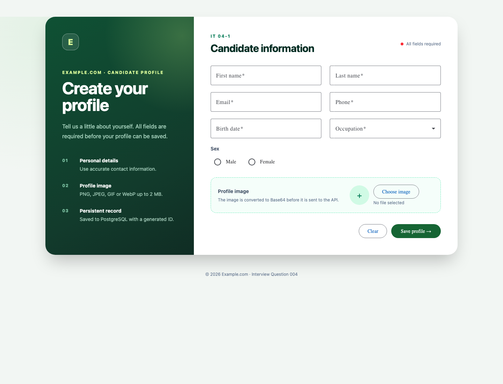
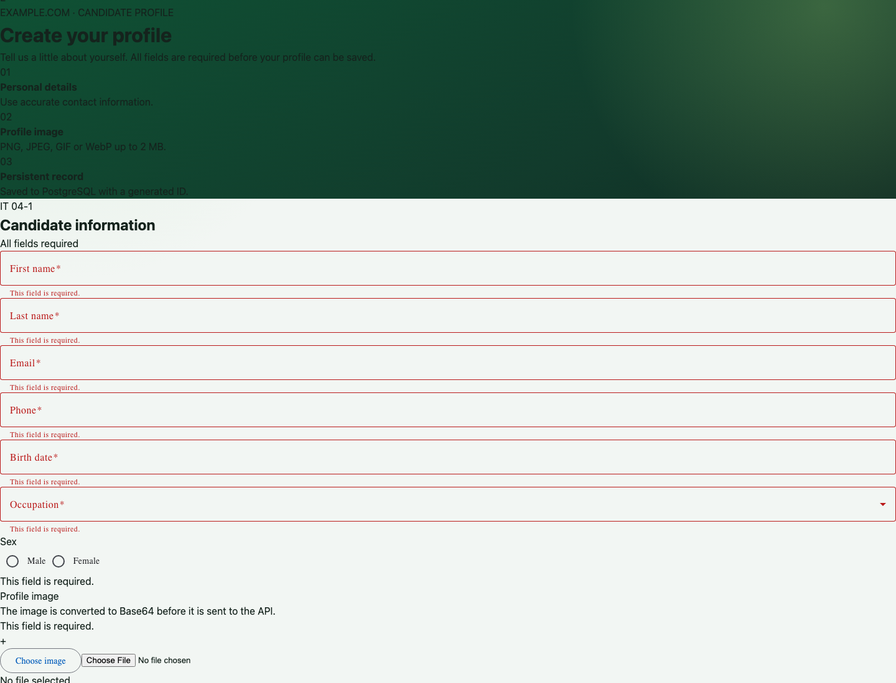
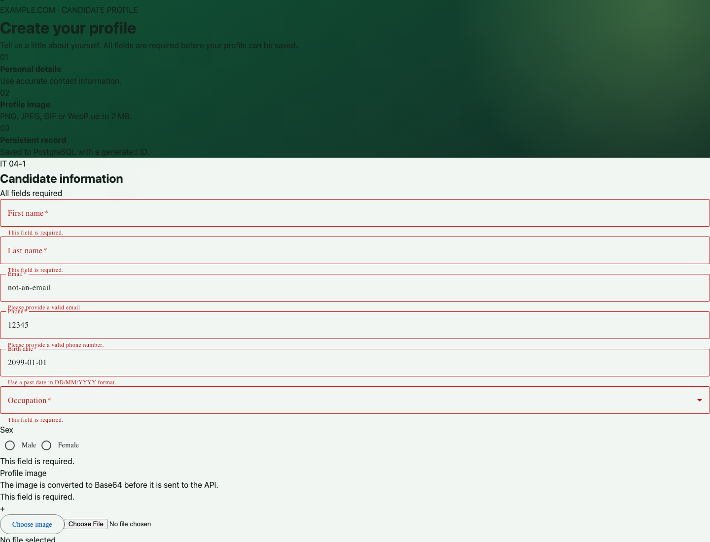
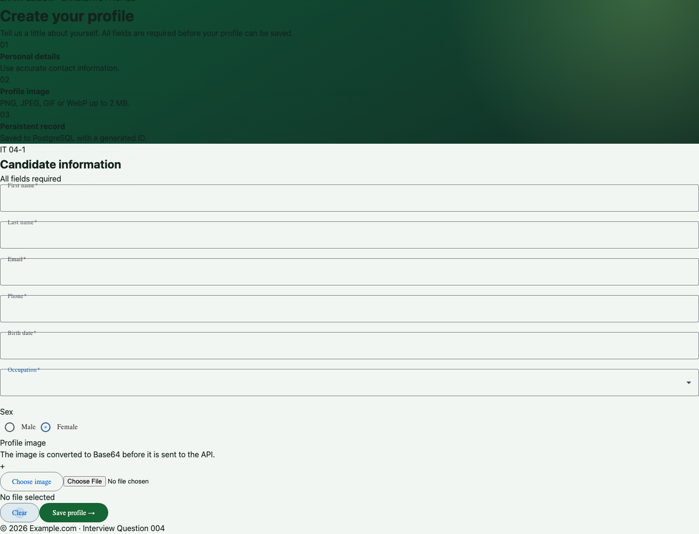
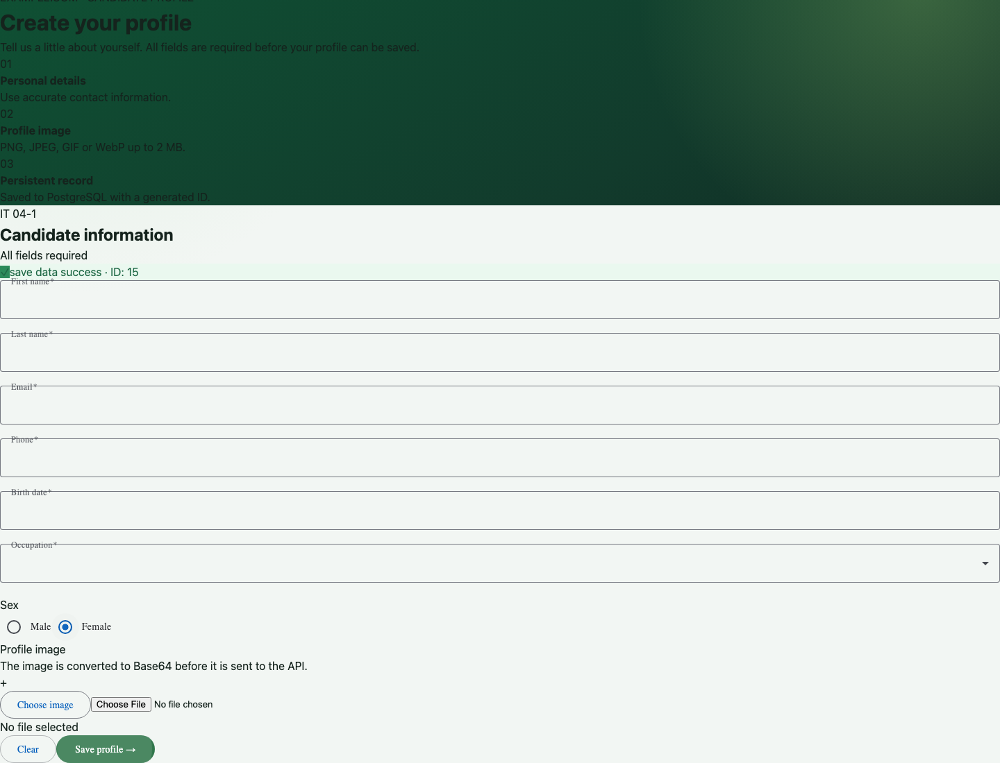
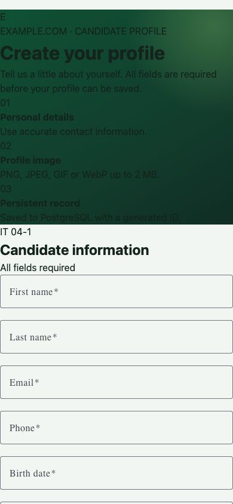
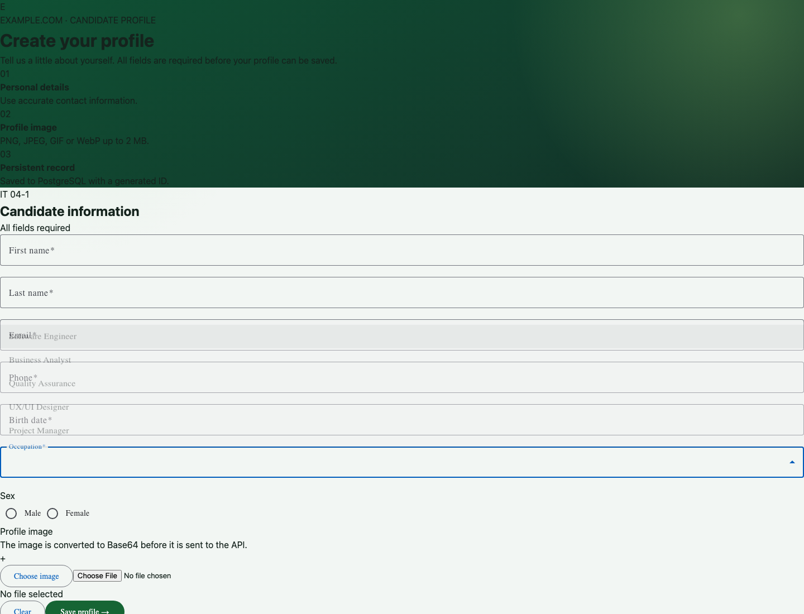
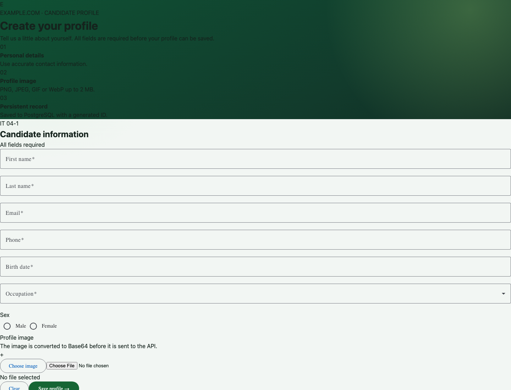

# QAT-CP-04 — ผลทดสอบ Playwright

> ไฟล์นี้สร้างอัตโนมัติจาก `npm run test:e2e` ห้ามแก้ผลด้วยมือ

## สภาพแวดล้อม

| รายการ       | ค่า                                                         |
| ------------ | ----------------------------------------------------------- |
| Base URL     | `http://127.0.0.1:4204`                                     |
| Browser      | Chromium                                                    |
| ระบบที่ทดสอบ | Angular → Nginx → ASP.NET Core API → PostgreSQL บน OrbStack |

## สรุปผล

| ทั้งหมด | ผ่าน | ไม่ผ่าน | สถานะชุดทดสอบ |
| ------: | ---: | ------: | ------------- |
|      13 |   13 |       0 | PASS          |

## ผลรายกรณี

| Test Case ID  | ชื่อกรณีทดสอบ                                             | Project  | ผล   | เวลา (ms) | Screenshot                               |
| ------------- | --------------------------------------------------------- | -------- | ---- | --------: | ---------------------------------------- |
| TC-CP-E2E-001 | แสดงฟิลด์และปุ่มตามข้อกำหนด                               | chromium | PASS |       260 | [เปิดภาพ](screenshots/tc-cp-e2e-001.png) |
| TC-CP-E2E-002 | ปฏิเสธการส่งแบบฟอร์มว่างโดยไม่เรียก API                   | chromium | PASS |       264 | [เปิดภาพ](screenshots/tc-cp-e2e-002.png) |
| TC-CP-E2E-003 | แสดงข้อผิดพลาดของอีเมล โทรศัพท์ และวันเกิด                | chromium | PASS |       276 | [เปิดภาพ](screenshots/tc-cp-e2e-003.png) |
| TC-CP-E2E-004 | ปุ่ม Clear ล้างข้อมูลและรูปตัวอย่าง                       | chromium | PASS |       674 | [เปิดภาพ](screenshots/tc-cp-e2e-004.png) |
| TC-CP-E2E-005 | บันทึกโปรไฟล์ผ่าน API และล้างสถานะแบบฟอร์ม                | chromium | PASS |       615 | [เปิดภาพ](screenshots/tc-cp-e2e-005.png) |
| TC-CP-E2E-006 | API ตอบ ValidationProblemDetails เมื่อ payload ไม่ถูกต้อง | chromium | PASS |       206 | [เปิดภาพ](screenshots/tc-cp-e2e-006.png) |
| TC-CP-E2E-007 | หน้าจอมือถือไม่มีการล้นแนวนอน                             | chromium | PASS |       195 | [เปิดภาพ](screenshots/tc-cp-e2e-007.png) |
| TC-CP-E2E-008 | แสดงข้อมูลหลักอาชีพจาก API ตามลำดับ                       | chromium | PASS |       253 | [เปิดภาพ](screenshots/tc-cp-e2e-008.png) |
| SEC-CP-001    | ปฏิเสธรูปที่ถอดรหัสแล้วเกิน 2 MiB                         | chromium | PASS |       223 | [เปิดภาพ](screenshots/sec-cp-001.png)    |
| SEC-CP-002    | ปฏิเสธ MIME ที่ไม่ตรงกับ byte signature                   | chromium | PASS |       183 | [เปิดภาพ](screenshots/sec-cp-002.png)    |
| SEC-CP-003    | ปฏิเสธ request body เกิน 3 MiB                            | chromium | PASS |       190 | [เปิดภาพ](screenshots/sec-cp-003.png)    |
| SEC-CP-008    | ส่ง security headers ผ่าน Nginx                           | chromium | PASS |       206 | [เปิดภาพ](screenshots/sec-cp-008.png)    |
| SEC-CP-004    | จำกัดอัตราคำขอสร้างข้อมูล                                 | chromium | PASS |       224 | [เปิดภาพ](screenshots/sec-cp-004.png)    |

## ภาพหลักฐาน

### TC-CP-E2E-001 — แสดงฟิลด์และปุ่มตามข้อกำหนด

### TC-CP-E2E-002 — ปฏิเสธการส่งแบบฟอร์มว่างโดยไม่เรียก API

### TC-CP-E2E-003 — แสดงข้อผิดพลาดของอีเมล โทรศัพท์ และวันเกิด

### TC-CP-E2E-004 — ปุ่ม Clear ล้างข้อมูลและรูปตัวอย่าง

### TC-CP-E2E-005 — บันทึกโปรไฟล์ผ่าน API และล้างสถานะแบบฟอร์ม

### TC-CP-E2E-006 — API ตอบ ValidationProblemDetails เมื่อ payload ไม่ถูกต้อง

### TC-CP-E2E-007 — หน้าจอมือถือไม่มีการล้นแนวนอน

### TC-CP-E2E-008 — แสดงข้อมูลหลักอาชีพจาก API ตามลำดับ

### SEC-CP-001 — ปฏิเสธรูปที่ถอดรหัสแล้วเกิน 2 MiB

### SEC-CP-002 — ปฏิเสธ MIME ที่ไม่ตรงกับ byte signature

### SEC-CP-003 — ปฏิเสธ request body เกิน 3 MiB

### SEC-CP-008 — ส่ง security headers ผ่าน Nginx

### SEC-CP-004 — จำกัดอัตราคำขอสร้างข้อมูล

## การสืบย้อน

- รายละเอียดขั้นตอนและผลที่คาดหวัง: `playwright-test-cases.md`
- รหัสทดสอบในรายงานตรงกับชื่อ `test()` ใน `src/client/e2e/candidate-profile.spec.ts` และ `src/client/e2e/security.spec.ts`
