# QAT-PF-04 — ผลทดสอบ Playwright

> ไฟล์นี้สร้างอัตโนมัติจาก `npm run test:e2e` ห้ามแก้ผลด้วยมือ

## สภาพแวดล้อม

| รายการ       | ค่า                                                         |
| ------------ | ----------------------------------------------------------- |
| Base URL     | `http://127.0.0.1:4204`                                     |
| Browser      | Chromium                                                    |
| ระบบที่ทดสอบ | Angular → Nginx → ASP.NET Core API → PostgreSQL บน OrbStack |

## สรุปผล

| ทั้งหมด | ผ่าน | ไม่ผ่าน | สถานะชุดทดสอบ |
| ------: | ---: | ------: | ------------- |
|      18 |   18 |       0 | PASS          |

## ผลรายกรณี

| Test Case ID      | ชื่อกรณีทดสอบ                                             | Project  | ผล   | เวลา (ms) | Screenshot                                   |
| ----------------- | --------------------------------------------------------- | -------- | ---- | --------: | -------------------------------------------- |
| TC-PF-E2E-001     | แสดงหมวดข้อมูล ฟิลด์ และปุ่มตามข้อกำหนด                   | chromium | PASS |       228 | [เปิดภาพ](screenshots/tc-pf-e2e-001.png)     |
| TC-PF-CONTENT-001 | ไม่แสดงรหัสข้อสอบ ข้อมูลทดสอบ หรือข้อความซ้ำบน production | chromium | PASS |       178 | [เปิดภาพ](screenshots/tc-pf-content-001.png) |
| TC-PF-E2E-002     | ปฏิเสธการส่งแบบฟอร์มว่างโดยไม่เรียก API                   | chromium | PASS |       271 | [เปิดภาพ](screenshots/tc-pf-e2e-002.png)     |
| TC-PF-E2E-003     | แสดงข้อผิดพลาดของอีเมล โทรศัพท์ และวันเกิด                | chromium | PASS |       284 | [เปิดภาพ](screenshots/tc-pf-e2e-003.png)     |
| TC-PF-E2E-004     | ปุ่ม Clear ล้างข้อมูลและรูปตัวอย่าง                       | chromium | PASS |       490 | [เปิดภาพ](screenshots/tc-pf-e2e-004.png)     |
| TC-PF-E2E-005     | บันทึกโปรไฟล์ แสดง Toast พร้อม ID และล้างสถานะแบบฟอร์ม    | chromium | PASS |       929 | [เปิดภาพ](screenshots/tc-pf-e2e-005.png)     |
| TC-PF-E2E-006     | API ตอบ ValidationProblemDetails เมื่อ payload ไม่ถูกต้อง | chromium | PASS |       195 | [เปิดภาพ](screenshots/tc-pf-e2e-006.png)     |
| TC-PF-E2E-007     | หน้าจอมือถือไม่มีการล้นแนวนอน                             | chromium | PASS |       223 | [เปิดภาพ](screenshots/tc-pf-e2e-007.png)     |
| TC-PF-E2E-008     | แสดงข้อมูลหลักอาชีพจาก API ตามลำดับ                       | chromium | PASS |       223 | [เปิดภาพ](screenshots/tc-pf-e2e-008.png)     |
| TC-PF-E2E-009     | แสดงรูปโปรไฟล์ใน avatar แบบองค์กร                         | chromium | PASS |       609 | [เปิดภาพ](screenshots/tc-pf-e2e-009.png)     |
| TC-PF-E2E-010     | เลือกวันเกิดผ่าน Angular Material Datepicker              | chromium | PASS |       255 | [เปิดภาพ](screenshots/tc-pf-e2e-010.png)     |
| TC-PF-E2E-011     | API ล้มเหลวแสดง Error Toast และคงข้อมูล                   | chromium | PASS |       837 | [เปิดภาพ](screenshots/tc-pf-e2e-011.png)     |
| SEC-PF-001        | ปฏิเสธรูปที่ถอดรหัสแล้วเกิน 2 MiB                         | chromium | PASS |       205 | [เปิดภาพ](screenshots/sec-pf-001.png)        |
| SEC-PF-002        | ปฏิเสธ MIME ที่ไม่ตรงกับ byte signature                   | chromium | PASS |       158 | [เปิดภาพ](screenshots/sec-pf-002.png)        |
| SEC-PF-003        | ปฏิเสธ request body เกิน 3 MiB                            | chromium | PASS |       192 | [เปิดภาพ](screenshots/sec-pf-003.png)        |
| SEC-PF-011        | ปฏิเสธ GIF และ WebP                                       | chromium | PASS |       214 | [เปิดภาพ](screenshots/sec-pf-011.png)        |
| SEC-PF-008        | ส่ง security headers ผ่าน Nginx                           | chromium | PASS |       191 | [เปิดภาพ](screenshots/sec-pf-008.png)        |
| SEC-PF-004        | จำกัดอัตราคำขอสร้างข้อมูล                                 | chromium | PASS |       242 | [เปิดภาพ](screenshots/sec-pf-004.png)        |

## ภาพหลักฐาน

### TC-PF-E2E-001 — แสดงหมวดข้อมูล ฟิลด์ และปุ่มตามข้อกำหนด

### TC-PF-CONTENT-001 — ไม่แสดงรหัสข้อสอบ ข้อมูลทดสอบ หรือข้อความซ้ำบน production

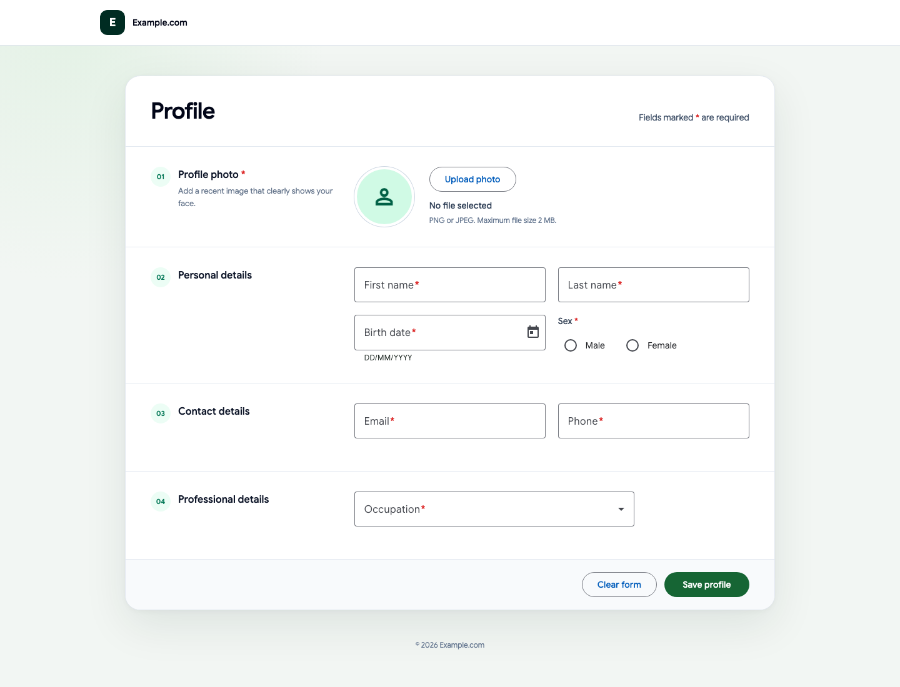

### TC-PF-E2E-002 — ปฏิเสธการส่งแบบฟอร์มว่างโดยไม่เรียก API

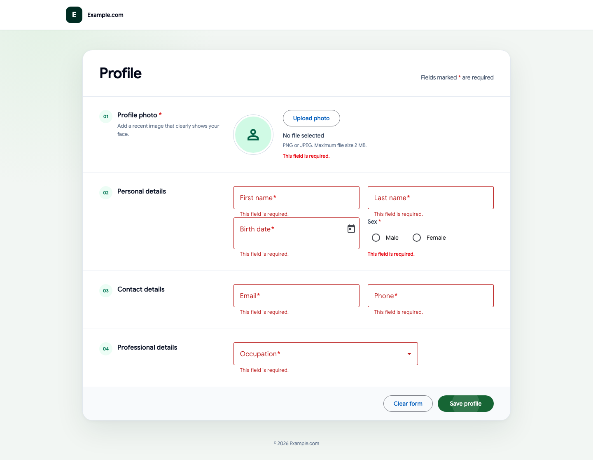

### TC-PF-E2E-003 — แสดงข้อผิดพลาดของอีเมล โทรศัพท์ และวันเกิด

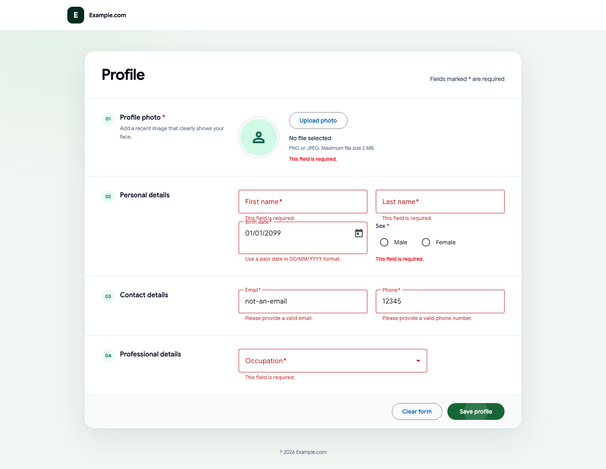

### TC-PF-E2E-004 — ปุ่ม Clear ล้างข้อมูลและรูปตัวอย่าง

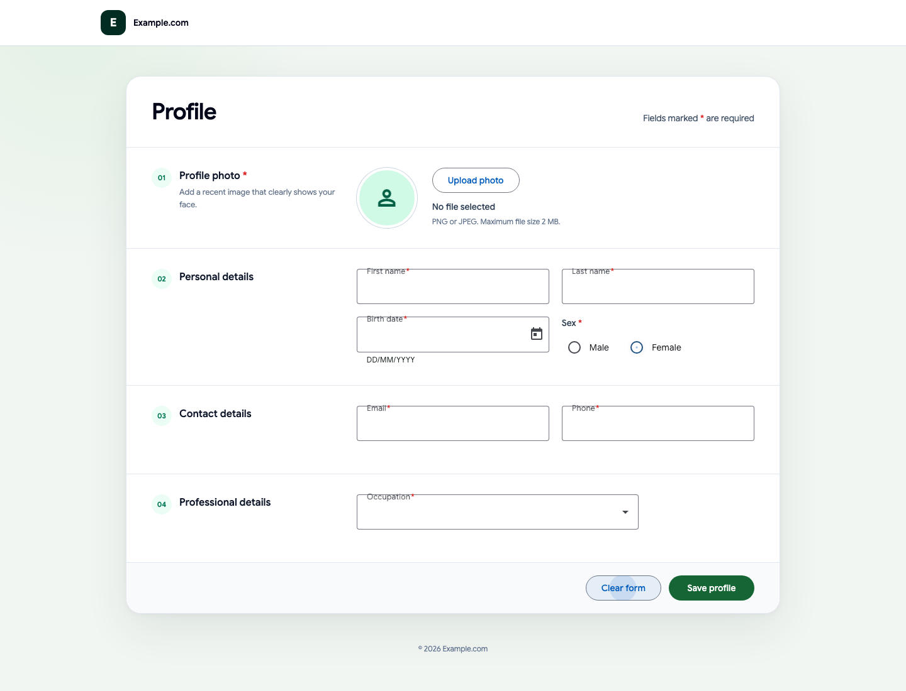

### TC-PF-E2E-005 — บันทึกโปรไฟล์ แสดง Toast พร้อม ID และล้างสถานะแบบฟอร์ม

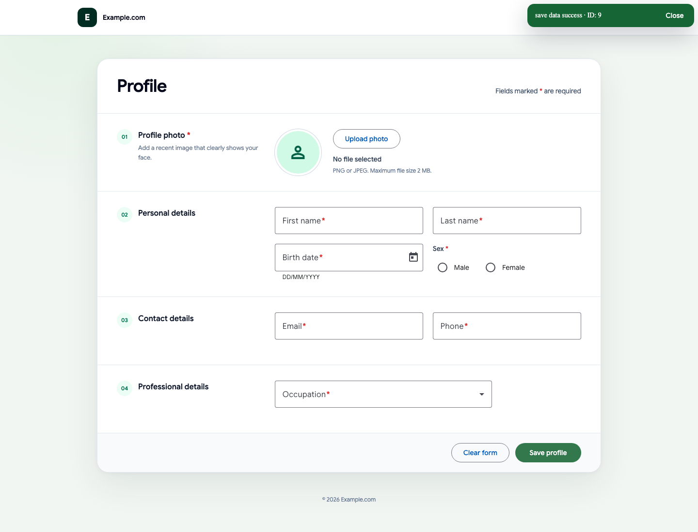

### TC-PF-E2E-006 — API ตอบ ValidationProblemDetails เมื่อ payload ไม่ถูกต้อง

### TC-PF-E2E-007 — หน้าจอมือถือไม่มีการล้นแนวนอน

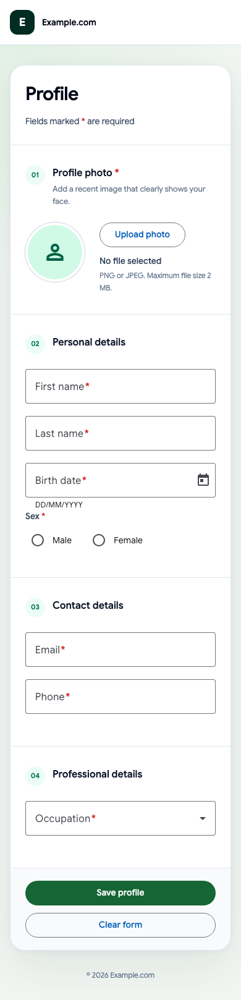

### TC-PF-E2E-008 — แสดงข้อมูลหลักอาชีพจาก API ตามลำดับ

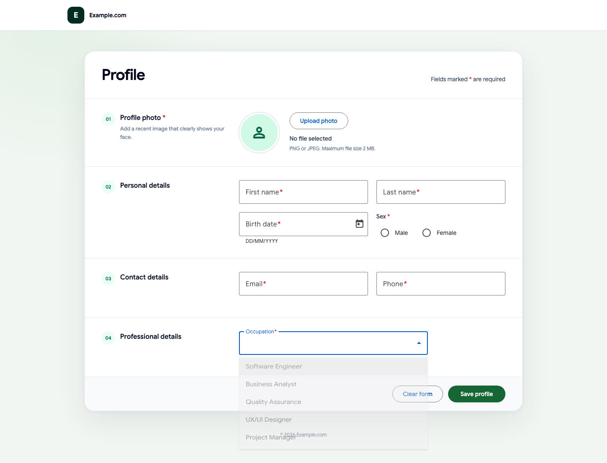

### TC-PF-E2E-009 — แสดงรูปโปรไฟล์ใน avatar แบบองค์กร

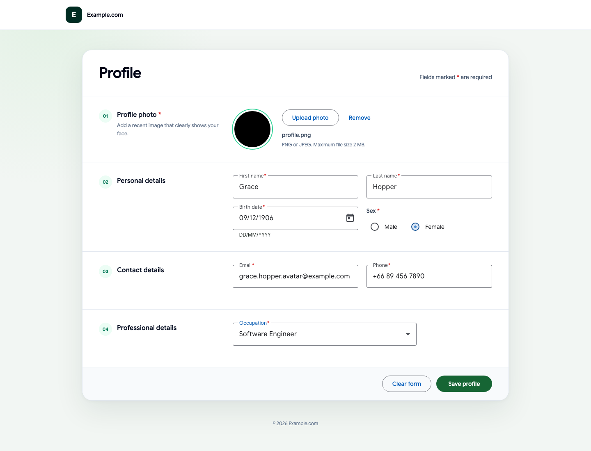

### TC-PF-E2E-010 — เลือกวันเกิดผ่าน Angular Material Datepicker

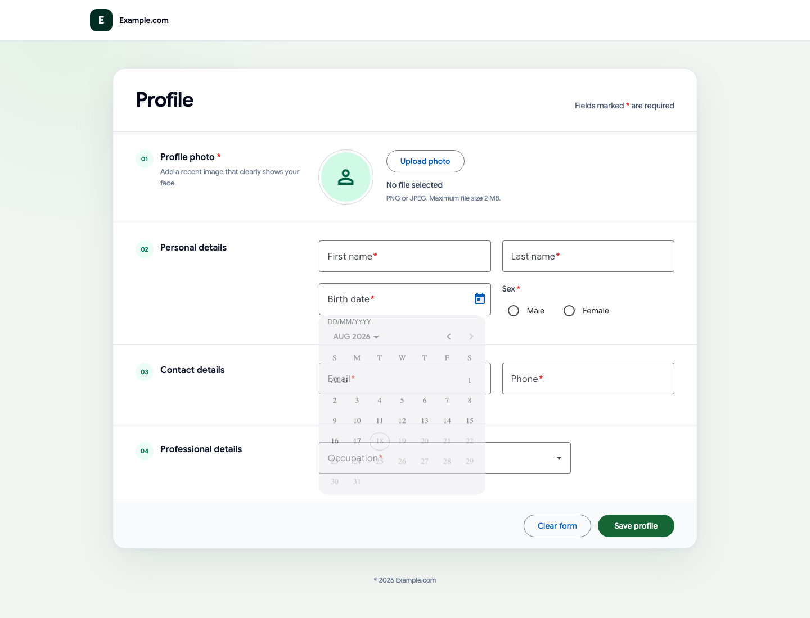

### TC-PF-E2E-011 — API ล้มเหลวแสดง Error Toast และคงข้อมูล

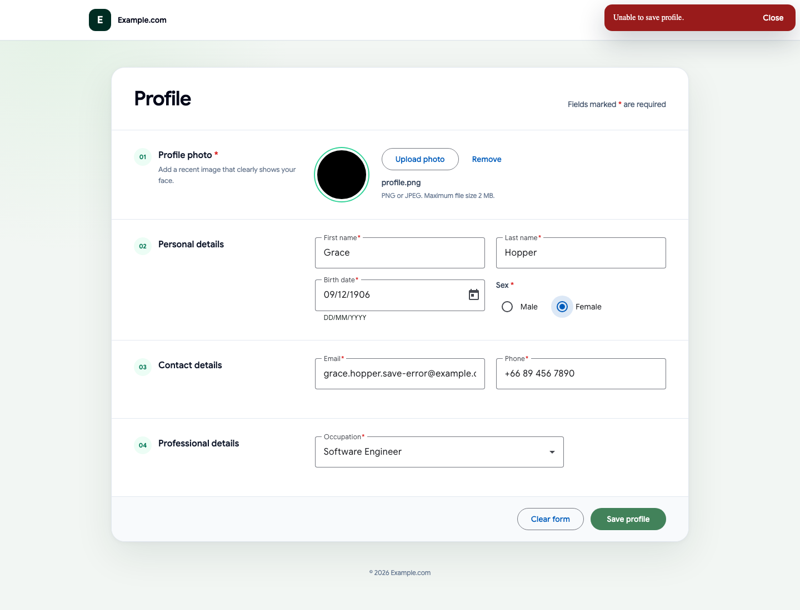

### SEC-PF-001 — ปฏิเสธรูปที่ถอดรหัสแล้วเกิน 2 MiB

### SEC-PF-002 — ปฏิเสธ MIME ที่ไม่ตรงกับ byte signature

### SEC-PF-003 — ปฏิเสธ request body เกิน 3 MiB

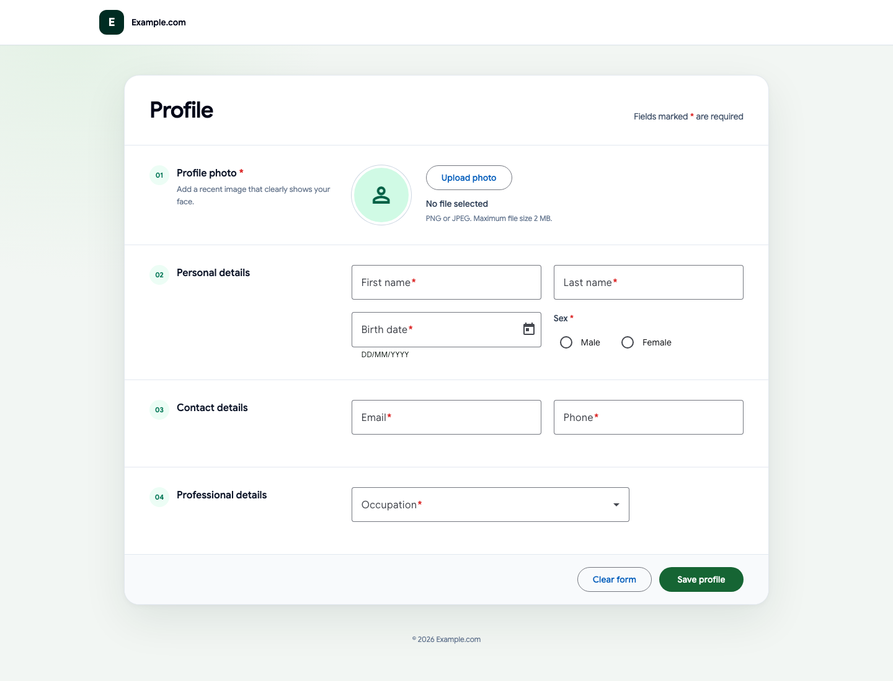

### SEC-PF-011 — ปฏิเสธ GIF และ WebP

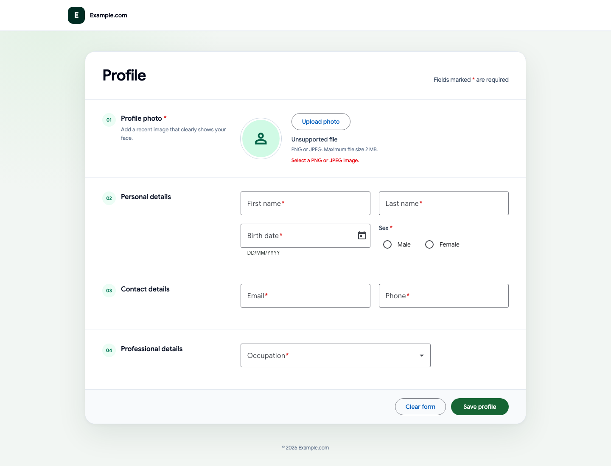

### SEC-PF-008 — ส่ง security headers ผ่าน Nginx

### SEC-PF-004 — จำกัดอัตราคำขอสร้างข้อมูล

## การสืบย้อน

- รายละเอียดขั้นตอนและผลที่คาดหวัง: `playwright-test-cases.md`
- รหัสทดสอบในรายงานตรงกับชื่อ `test()` ใน `src/client/e2e/profile.spec.ts` และ `src/client/e2e/security.spec.ts`
